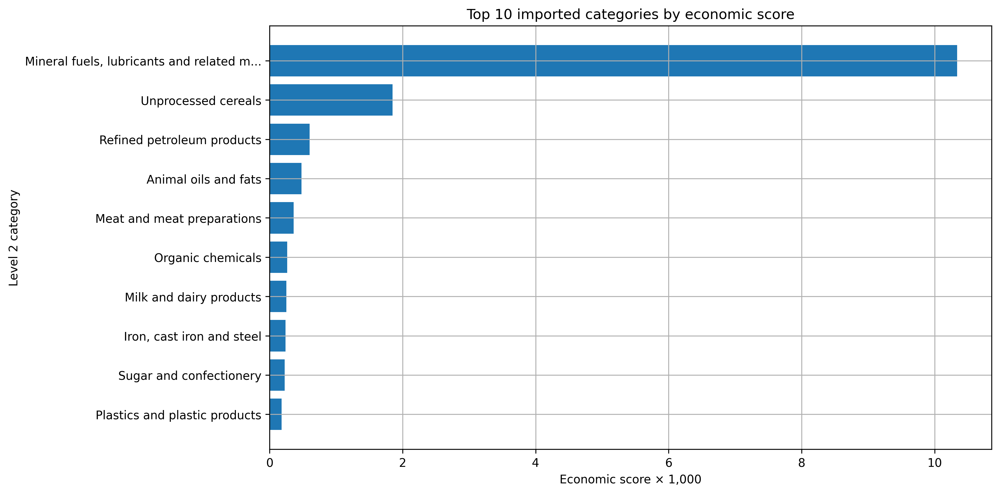
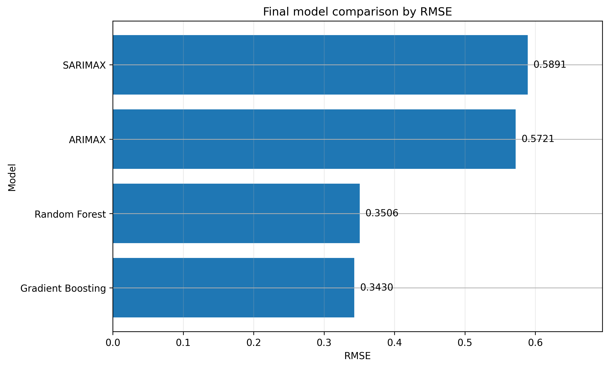
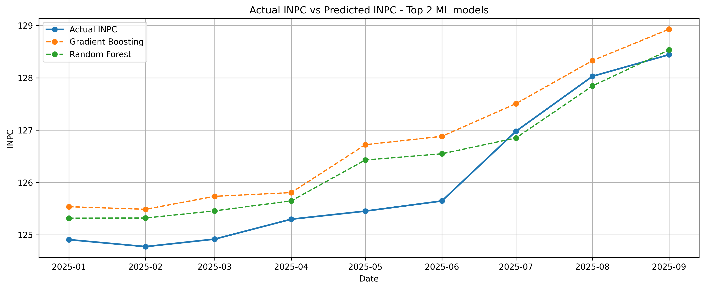

# Imported Inflation Analysis in Mauritania

An econometric and machine-learning study of how import prices, exchange-rate movements and major imported product categories are associated with inflation in Mauritania.

This repository is the public, English-language version of a Data Science graduation project completed at the University of Nouakchott. The project was developed during an academic internship at the **National Agency for Statistics and Demographic and Economic Analysis** (*L’Agence Nationale de la Statistique et de l’Analyse Démographique et Économique — ANSADE*) in Mauritania.

> **Data privacy:** the original institutional datasets are not included in this repository. The public version contains the methodology, source code, aggregated tables and final figures only.

## Project overview

Mauritania imports a large share of its food, energy and manufactured goods. Changes in international prices and in the USD/MRU exchange rate can therefore affect domestic consumer prices.

The project addresses two questions:

1. Which imported product categories are most strongly associated with inflation in Mauritania?
2. Which statistical or machine-learning model best predicts monthly inflation and the National Consumer Price Index (INPC)?

## Objectives

- Prepare and combine monthly INPC, Import Unit Value Index (UVI), exchange-rate and detailed import data.
- Measure immediate and delayed transmission effects using Distributed Lag Models (DLM).
- Rank the ten most economically relevant imported categories.
- Compare statistical and machine-learning forecasting models.
- Produce interpretable tables and figures for economic monitoring.

## Data used

The original analysis uses four institutional data sources:

| Data source | Role in the analysis |
|---|---|
| National Consumer Price Index (INPC) | Measures the monthly evolution of consumer prices and inflation |
| Import Unit Value Index (UVI) | Represents changes in import prices |
| USD/MRU exchange rate | Captures the exchange-rate transmission channel |
| Detailed Level 2 import records | Identifies imported categories associated with inflation |

After preparation, the detailed import database contains **164,737 records** and **91 usable Level 2 categories**. The common monthly analysis period contains **69 observations**, from **January 2020 to September 2025**.

## Methodology

### 1. Data preparation

- Date conversion and monthly harmonisation
- Cleaning of missing or invalid records
- Aggregation of import value and net weight
- Construction of unit prices and import shares
- Merging of INPC, UVI and exchange-rate series
- Creation of lagged variables

### 2. Exploratory analysis

The project examines:

- The evolution of INPC and UVI
- Monthly inflation and UVI variations
- Immediate and lagged correlations
- The contribution of major imported categories

### 3. Distributed Lag Models

A separate DLM is estimated for each eligible Level 2 import category. The model evaluates effects from the current month up to six monthly lags.

The final ranking is based on an economic score combining:

- The cumulative estimated DLM effect
- The category's share in total import value

### 4. Forecasting models

The original project compares the following models:

**Statistical models**

- ARIMAX
- SARIMAX

**Machine-learning models**

- Elastic Net
- Ridge
- Lasso
- Random Forest
- Gradient Boosting

The models are evaluated using MAE, RMSE, MAPE and R². The original train/test split is preserved, with the test period beginning in January 2025.

## Main results

### Most sensitive imported categories

The Top 10 ranking is led by:

1. Mineral fuels, lubricants and related materials
2. Unprocessed cereals
3. Refined petroleum products
4. Animal oils and fats
5. Meat and meat preparations
6. Organic chemicals
7. Milk and dairy products
8. Iron, cast iron and steel
9. Sugar and confectionery
10. Plastics and plastic products

Energy-related categories dominate the ranking, while several essential food categories also appear among the most economically relevant imports.



### Forecasting performance

The original final comparison retains Gradient Boosting as the best-performing model according to RMSE, while Random Forest remains highly competitive.

| Model | MAE | RMSE | MAPE | R² |
|---|---:|---:|---:|---:|
| Gradient Boosting | 0.2686 | **0.3430** | 0.5732 | 0.9487 |
| Random Forest | **0.2473** | 0.3506 | **0.3655** | 0.9368 |
| ARIMAX | 0.4329 | 0.5721 | 1.4160 | 0.7453 |
| SARIMAX | 0.4108 | 0.5891 | 1.2025 | 0.7446 |





Public result files:

- [Results index](results/README.md)
- [Top 10 imported categories table](results/tables/top10_imported_categories.csv)
- [Final model comparison table](results/tables/final_model_comparison.csv)

## Repository structure

```text
imported-inflation-mauritania/
├── README.md
├── requirements.txt
├── .gitignore
├── data/
│   └── README.md
├── notebooks/
│   └── imported_inflation_analysis.ipynb
├── results/
│   ├── README.md
│   ├── figures/
│   └── tables/
└── src/
```

## Data availability and privacy

The original datasets were used during an academic internship at the **National Agency for Statistics and Demographic and Economic Analysis** (*L’Agence Nationale de la Statistique et de l’Analyse Démographique et Économique — ANSADE*) and are not redistributed publicly.

To run the complete analysis locally:

1. Obtain authorised access to the original source files.
2. Place them inside `data/private/`.
3. Keep the filenames configured in the notebook's project-path cell.
4. Run the notebook from the repository root.

The `data/private/` directory and Excel files are excluded through `.gitignore`.

Without the private source files, visitors can still:

- Review the complete methodology and source code
- Inspect the saved notebook outputs
- View the final aggregated tables and figures
- Understand the modelling and evaluation workflow

However, the data-dependent cells cannot be rerun and the original numerical results cannot be fully reproduced without authorised access to the institutional data. A project cannot be fully rerun on another person's computer while simultaneously keeping the input data inaccessible to that person. Secure remote execution or an approved anonymised dataset would be required to provide both execution and data confidentiality.

## Running the project locally

```bash
python -m venv .venv
```

Activate the environment:

```bash
# Windows
.venv\Scripts\activate

# macOS / Linux
source .venv/bin/activate
```

Install the required libraries:

```bash
pip install -r requirements.txt
```

Start Jupyter Notebook:

```bash
jupyter notebook notebooks/imported_inflation_analysis.ipynb
```

## Scope, limitations and future improvements

The results should be interpreted within the scope of the available data and the 2020–2025 study period:

- The monthly series contains 69 observations, which limits long-horizon generalisation.
- The analysis identifies statistical associations and forecasting performance; it does not establish definitive causal effects.
- Other transmission channels, including international commodity prices, freight costs, subsidies, market structure and supply disruptions, are not fully represented in the available variables.
- Full external reproducibility is restricted because the institutional source data are not publicly distributable.

Possible future improvements include extending the series with new monthly observations, adding external price and logistics indicators, testing structural stability over time, and providing a controlled reproducibility environment or an institutionally approved anonymised extract.

## Tools

- Python
- Jupyter Notebook
- pandas and NumPy
- Matplotlib
- statsmodels
- scikit-learn
- openpyxl

## Author

**Mohamed Val Mohamed El Mokhtar Mohamed Vall**  
Data Science graduate — University of Nouakchott  
Graduation project completed during an academic internship at the **National Agency for Statistics and Demographic and Economic Analysis (ANSADE)**

## Acknowledgement

This repository presents the public technical version of the graduation project. The methodology and reported results are preserved from the original academic work, while the institutional datasets remain private.
